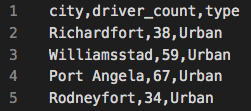
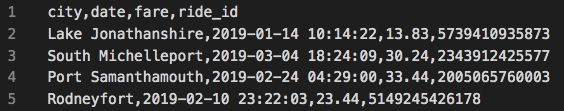
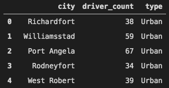
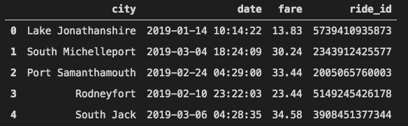
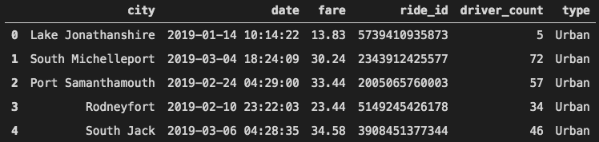
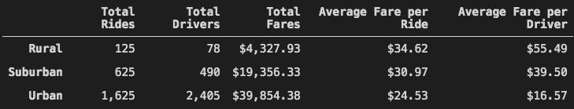
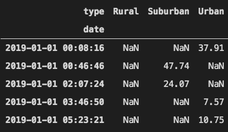
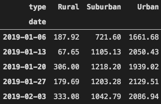
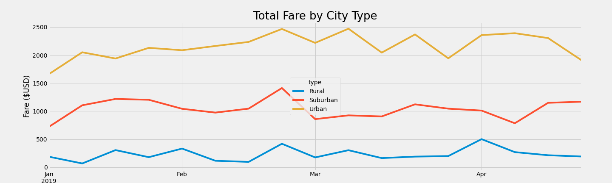

# **School District Analysis**  

## **Overview of Project**
in this project we are helping our client to  analyze the data gathered from a ride-sharing app

### **Purpose**

Our client is a ride-sharing app company PyBer that wants us to analyze the data they have provided and see if we can come up with any recommendations. The data was in form of two tabular data files ([city_data.csv](Resources/city_data.csv) and [ride_data.csv](Resources/ride_data.csv)). a part of these file are shown in the images below:

|*Fig. 1: city_data*|
:--:
||

|*Fig. 2: ride_data*|
:--:
||

&nbsp;
In the "city data" we have city names, number of the drivers in each city an the type of that city(urban, suburban or rural) while in the "ride data" we can find information about each ride like the ride id, fare, date of the ride and the city of that ride.

&nbsp;

## **Results**  

### **Analysis**
To perform the analysis we used Jupyter notebook, Python and its dependencies, pandas and matplotlib. First we read the source files ([city_data.csv](Resources/city_data.csv) and [ride_data.csv](Resources/ride_data.csv)) and load them into pandas data frames:

|*Fig. 3: city_data_dataframe*|
:--:
||

|*Fig. 4: ride_data_dataframe*|
:--:
||

&nbsp;
  
In the next step using ".merge" method in pandas we created a unified data frame as below (called: "pyber_data_df) in order to have all the data in one place:

&nbsp;

|*Fig. 5: Merged dsts frame*|
:---:
||

&nbsp;

We decided to focus on the key metrics of each city type in the analysis. To do so, we used the data frames we created to gather the information on the number of rides and number of drivers in each city type as well as the total amount of fare and the average fare per number of rides and drivers. we extracted the number of rides and total amount of fare from the merged data frame, but we used the "city_data" data frame to get the number of drivers as this way it was easier to avoid the duplicate values in the merged data frame. Then, to present the result of this analysis  we put all the data we gathered in a new data frame which shows the summary of the data:

&nbsp;

|*Fig. 6: PyBer data summary for each city type*|
:--:
||

&nbsp;

Another analysis was performed to find the total amount of fare collected in weekly increments in each city type during the first four months of the year. Based on our merged data frame we created a pivot table (using ".pivot()" method) which has the date of each ride as its index, city type as the columns and fare of each ride as the values: 

&nbsp;

|*Fig. 7: Fare amount for each ride in each city type*|
:--:
||

&nbsp;

In this pivot table we filtered the data for the first four months of the year. then we grouped the data in the table (using ".resample()" method) to show the sum of the fares for rides in each week:

&nbsp;

|*Fig. 8: Fares collected each week per city type*|
:--:
||

&nbsp;

Finally a line chart was plotted based on the data presented in the table above (using "matplotlib") :

&nbsp;

|*Fig. 9:  Total fare per week for each city type*|
:--:
||

&nbsp;

### **Conclusion**
["Fig. 6: PyBer data summary for each city type"](#fig6) illustrates that:
- The number of drivers and the number of rides increase when we go from rural city type to suburban and urban
- The maximum value for the total fares collected belongs to urban city type and suburban and rural city types are in the second and third place respectively
- average fare per driver has the highest value in the rural city type, suburban and urban city types come after that. This result could have been expected, because, the number of the drivers in rural city type is 6 and 30 times less than the number of drivers in suburban and urban city types, but, total fares collected associated with rural city type is 4.5 and 9 times less than suburban and urban city types
- The same conclusion can be drawn for the values of the "average fare per rides" column  
&nbsp;

according to ["Fig. 9:  Total fare per week for each city type"](#fig9):
- Not only the urban city type has the maximum total amount of fares collected but also we can see this statement is true for every week in the first four months of 2019.
- in urban city type the weekly amount of collected fares goes up slightly from almost $1700 in first week of January to $2500 in late February and early March and again falls back to just under $2000 in the last week of April
- We can roughly say that, except a peak in late February, the weekly amount of fares collected in the suburban and rural city types are constant(around $1000 for suburban city type and $200 for rural)  

## **summary**  

- To make the business more profitable in suburban and rural city types the company should develope a strategy to increase the number of drivers in those areas
- Another way is to lower the fares in those areas (if possible) to make it more interesting for passengers to use the service. This may increase the number of rides in rural and suburban city types
- It is more difficult for drivers to drive in the crowded streets of urban areas, so the company can use floating pricing plan for fares in these areas. For example they can increase the fares during rush hours, special wether conditions , etc.

